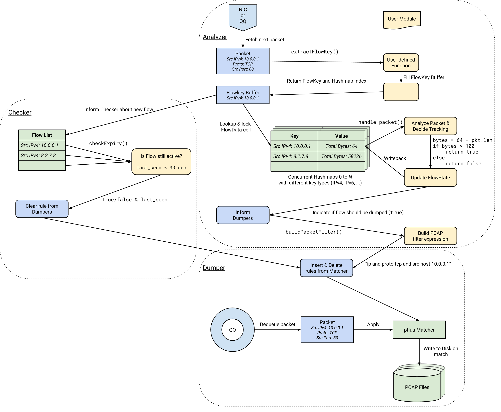
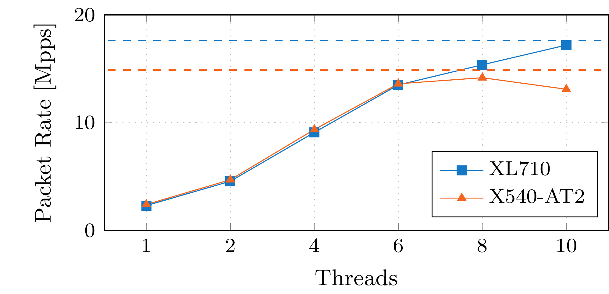

# FlowScope 

FlowScope is an oscilloscope for your network traffic. It records all traffic continuously in a ring buffer and dumps specific flows to disk on trigger events.
Triggers can be packets matching a user-defined filter.


# Architecture



FlowScope consists of 3 different task that classify, analyze and dump packets.
These can be programmed and modified by user modules written in Lua.

Further it uses the QQ ring buffer which allows non-destructive early dequeuing (peeking) at the head and the ``concurrent_hash_map`` from [TBB](https://www.threadingbuildingblocks.org/docs/help/index.htm).

Due to their nature as C++ template classes, ``concurrent_hash_map``s need to be instantiated with known key and value types at compile time. But this would require a module author to write their own bindings for their wanted flow keys and values. As this is bothersome, we already define and bind multiple versions of the hash maps with type agnostic byte arrays of common sizes. As long as a key/value fits in one of the byte arrays, a hash map can be created dynamically at run time with any type.


## Analyzer

The Analyzer(s) dequeues packets either directly from a NIC or through an intermediary ring buffer (QQ) as soon as they arrive (QQ_peek()). With the ``extractFlowKey()`` function each packet is classified into one of the N flow tables by extracting its identifying flow feature (e.g. 5-Tuple, IP ID, etc.). This process is idempotent and does not yet involve any state. Basic pre-filtering can be performed very cheaply here, e.g., by discarding IPv4 traffic in an IPv6-only measurement. The function therefore returns if a packet is interesting at all and to which hash table it belongs. The Checker is informed about every interesting packet.

From the flow key the flow state is looked up in the corresponding hash table. This locks the cell for exclusive read-write access until the user module function ``handlePacket()`` returns.
``handlePacket()`` can perform arbitrary flow analysis based on the flows previous state and the current packet and updates the flow state with new data. Should a threshold be passed or an anomaly be identified, the function request the archival of this flow by returning true (For efficiency reasons this should only happen once per flow. A simple bool flag in the flow state usually suffices). 

For such flows a PCAP filter expression has then to be build by the module in the ``buildPacketFilter()`` function.


## Checker

Since the modules ``handlePacket()`` function is only called for arriving packets, there would be no way to detect and delete inactive flows. Therefore a checker iterates over all flows in the hash table in regular intervals and passes them to the ``checkExpiry()`` module function. Here the user can decide if a flow is still active, by, e.g. keeping the timestamp of the last seen packet or protocol specific flags (e.g. TCP fin). Should a flow deemed inactive, it is purged from the hash map and the dumpers are instructed to forget its matching filter rule.

<i>Due to technical limitations hash tables generally are not concurrently iterable and write-able. As a workaround one can store every key in an array and just iterate of this array instead.</i>


## Dumper

Dumpers dequeue packets from the QQ ring buffer as late as possible to maximize the amount of information available in case of a detected anomaly.

The [pflua](https://github.com/Igalia/pflua) framework is used to facilitate high performance packet matching with the familiar PCAP filter syntax. More precisely the [pfmatch](https://github.com/Igalia/pflua/blob/master/doc/pfmatch.md) dialect, also seen in Snabb, is used. It is more powerful then normal pflang filters as it directly attaches functions to matches instead of just returning a yes/no filter decision. Together with the Lua-JIT compiler this allows better optimization and direct dumping to the appropriate per-flow pcap file.

Due to their (possibly immensely) delayed processing of the packets, rules can not be immediately discarded once a flow is inactive or the capture of interesting flows could end early, leading to missing packets.


# Installation

1. `git submodule update --init --recursive`
2. Compile libmoon in the `libmoon` submodule. Follow instructions [there](https://github.com/libmoon/libmoon#installation).
3. `cd build ; cmake .. ; make ; cd ..`
4. `./libmoon/build/libmoon flowscope.lua --help`

FlowScope requires gcc 5 or later. You can use

    CC=gcc-5 CXX=g++-5 cmake ..

to set the compiler if gcc 5 is not your default.


# Usage

## Immediate mode without buffering/dumping

A simple test setup with synthetic traffic for quick testing can be built with two directly connected machines.

* Install FlowScope on host A und [libmoon](https://github.com/emmericp/libmoon) on host B
* Start monitoring on host A: ```./libmoon/build/libmoon lua/flowscope.lua examples/liveStatistician.lua <dev>```
* Run ```./build/libmoon examples/pktgen.lua --rate=5000 <dev>``` on host B

The `pktgen.lua` MoonGen script generates 1000 UDP flows in the subnet 10.0.0.0/16 on random ports in the range 1234 to 2234.

For a 40 Gbit XL710 NIC you should see similar output like this on the monitor host:
```
Top flows over sliding 5s window:
#       bps     pps     Flow
1 649586.24 10826.44 ipv4_5tuple{ip_a: 10.0.0.10, ip_b: 10.1.0.10, port_a: 2143, port_b: 1234, proto: udp}
2 648500.83 10808.35 ipv4_5tuple{ip_a: 10.0.0.10, ip_b: 10.1.0.10, port_a: 1950, port_b: 1234, proto: udp}
3 647902.81 10798.38 ipv4_5tuple{ip_a: 10.0.0.10, ip_b: 10.1.0.10, port_a: 2164, port_b: 1234, proto: udp}
[...]
Active flows 1000, cumulative packets 53329880 [10665976.00/s], cumulative bytes 3199792800 [639958560.00/s], took 0.00s
```

## QQ mode with Dumpers

Foo bar

# Hardware Requirements

1. A CPU with a constant and invariant TSC. All recent Intel CPUs (Nehalem or newer) have this feature.
2. See [libmoon](https://github.com/emmericp/libmoon)
4. `./libmoon/build/libmoon flowscope.lua --help`

FlowScope requires gcc 5 or later. You can use

    CC=gcc-5 CXX=g++-5 cmake ..

to set the compiler if gcc 5 is not your default.


# Usage

## Immediate mode without buffering/dumping

A simple test setup with synthetic traffic for quick testing can be built with two directly connected machines.

* Install FlowScope on host A und [libmoon](https://github.com/emmericp/libmoon) on host B
* Start monitoring on host A: ```./libmoon/build/libmoon lua/flowscope.lua examples/liveStatistician.lua <dev>```
* Run ```./build/libmoon examples/pktgen.lua --rate=5000 <dev>``` on host B

The `pktgen.lua` MoonGen script generates 1000 UDP flows in the subnet 10.0.0.0/16 on random ports in the range 1234 to 2234.

For a 40 Gbit XL710 NIC you should see similar output like this on the monitor host:
```
Top flows over sliding 5s window:
#       bps     pps     Flow
1 649586.24 10826.44 ipv4_5tuple{ip_a: 10.0.0.10, ip_b: 10.1.0.10, port_a: 2143, port_b: 1234, proto: udp}
2 648500.83 10808.35 ipv4_5tuple{ip_a: 10.0.0.10, ip_b: 10.1.0.10, port_a: 1950, port_b: 1234, proto: udp}
3 647902.81 10798.38 ipv4_5tuple{ip_a: 10.0.0.10, ip_b: 10.1.0.10, port_a: 2164, port_b: 1234, proto: udp}
[...]
Active flows 1000, cumulative packets 53329880 [10665976.00/s], cumulative bytes 3199792800 [639958560.00/s], took 0.00s
```

## QQ mode with Dumpers

Foo bar

# Hardware Requirements

1. A CPU with a constant and invariant TSC. All recent Intel CPUs (Nehalem or newer) have this feature.
2. See [libmoon](https://github.com/emmericp/libmoon)

# Mini Benchmark

The following mini benchmark show the processing rate of FlowScope analyzer threads when doing no analysis on packets.
To minimize influence of module functions, the benchmark was created with the noop.lua module which does only extract IP 5-Tuples and accesses the hash tables, but does not calculate anything. It more or less measures the upper performance bound.

